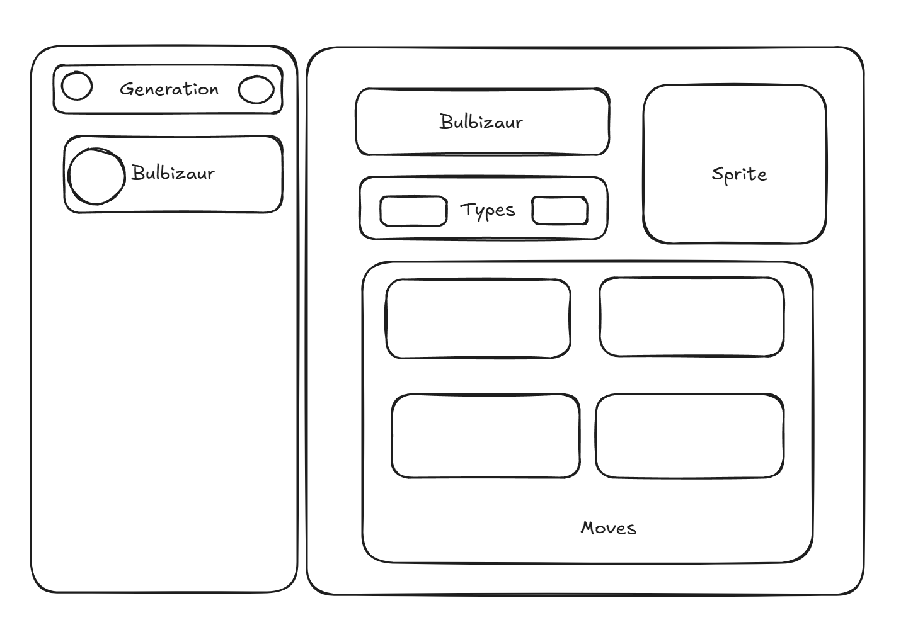

# Exercice Vue.js #4 - PokeAPI avec Pinia et Router

## Objectifs 

Comprendre et utiliser les mécanisme de store via Pinia et de routing avec Vue-Router

## Sujet

Réaliser un affichage des pokémons par génération en vous servant de [PokeAPI](https://pokeapi.co/).

* L'objectif est ici de permettre de sélectionner la génération que l'on veut visualiser de sorte à observer, dans la partie gauche de l'application, le listing des pokémons de cette génération
* En appuyant sur un des pokémons du listing, on doit avoir un affichage de ces détails dans la partie droite de l'application (son nom, son sprite par défaut, ses techniques et ses types par exemple)

Afin de pratiquer le routing, l'application doit utiliser une route changeante lors de la modification: 
* De la génération actuellement sélectionnée
* Du changement de pokémon que l'on veut afficher

Le template de l'application se servira également de routes enfants de sorte à avoir un affichage des pokémons par génération dans un composant de display et de présence d'un `<RouterView />` en son sein (afin de permettre le placement des détails sur la partie droite et présence du listing dans la partie gauche en tout temps)

---

Pour vous aider, n'hésitez pas à vous servir du shéma ci-dessous:

